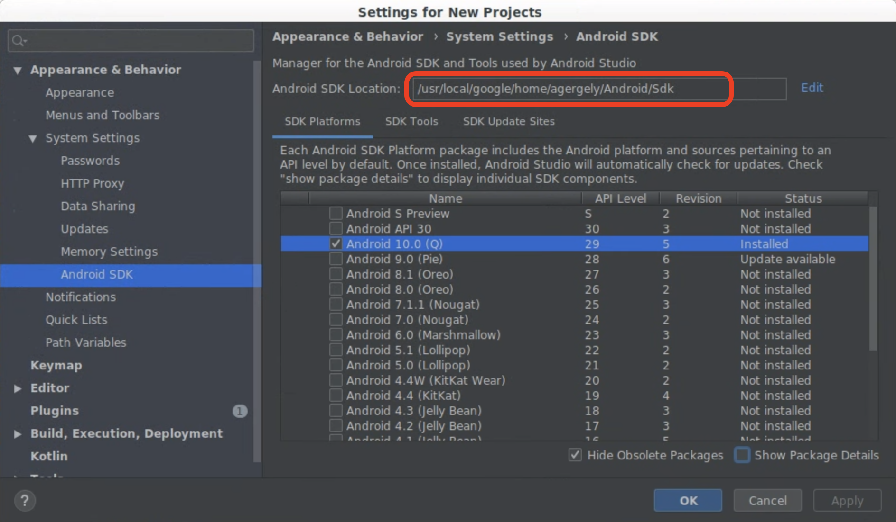
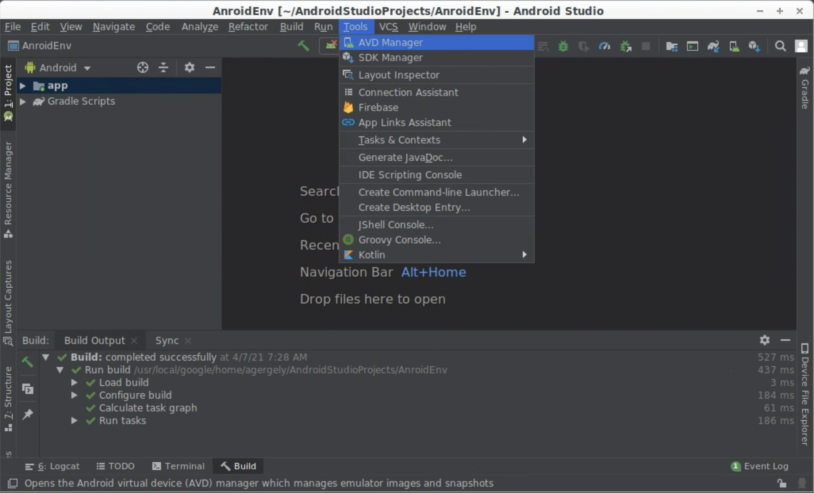
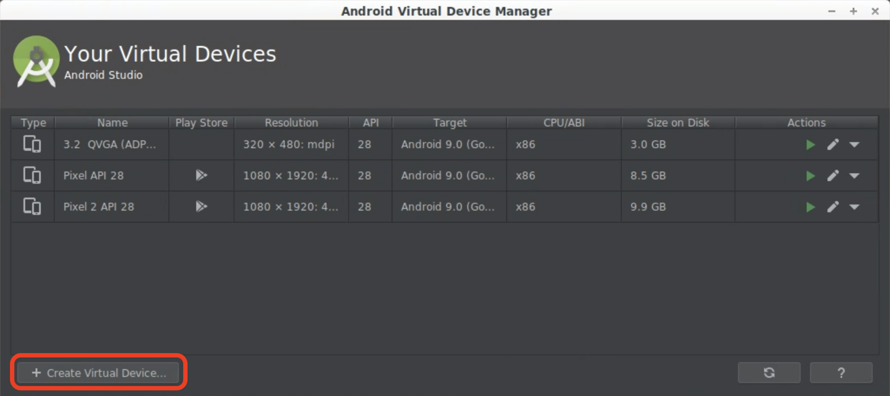
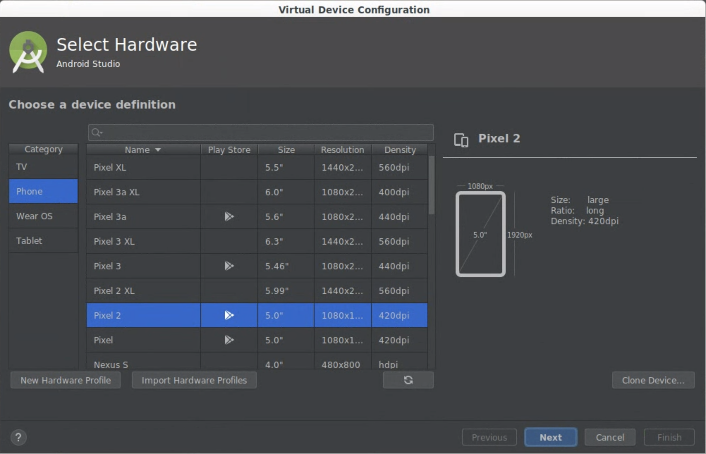
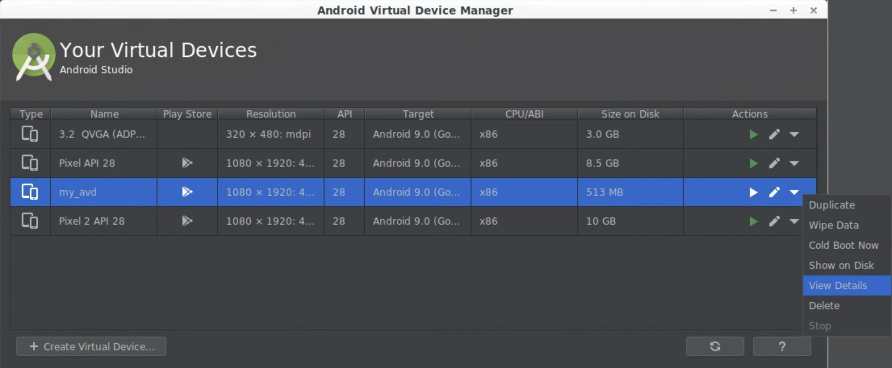
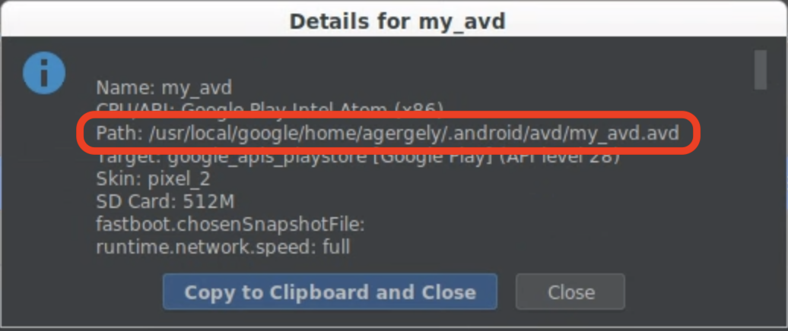
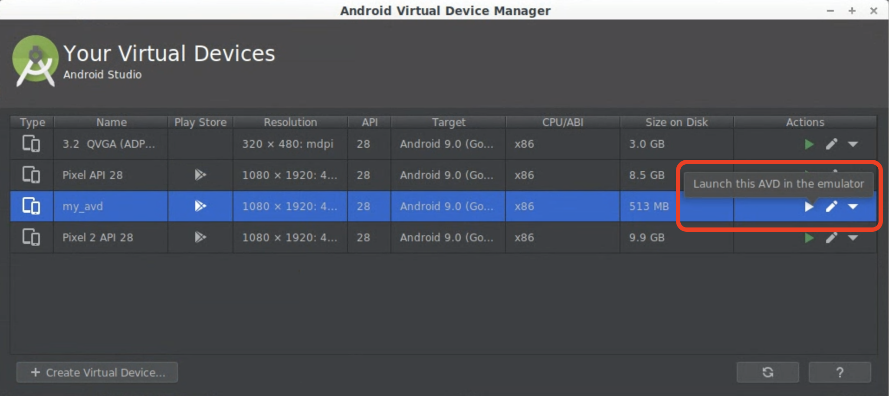

# AndroidEnv - Emulator Setup Guide

In this document we provide a step-by-step guide for creating a virtual Android
device with Android Studio. After creating an AVD
([Android Virtual Device](https://developer.android.com/studio/run/managing-avds))
you will be able to connect it to an AndroidEnv instance and you're ready to go.

To get started, you will need to download
[Android Studio](https://developer.android.com/studio), a
software widely used by Android developers.

## Install an SDK Platform Package

Android Studio comes with the Android Software Development Toolkit (SDK) which,
among others, allows you to install different versions of Android. Open the
**SDK Manager** to select a version that you would like to use.


We recommend that you set the `Android SDK Location` to be in your home
directory (`~/Android/Sdk`). If not, take note of the custom `Android SDK
Location` - this information will be required for connecting AndroidEnv to your
virtual Android device.



## Create an AVD

Now it is time to create a virtual device (AVD). Select the **AVD Manager**.



In the pop-up window you will find an option to **Create Virtual Device**.



Configure the virtual device. You can select the model or choose from more
advanced settings.



Name your AVD and take note of this value. It will be neccessary for connecting
AndroidEnv to this device.


Once this step is done, you will see the new AVD show up in the **AVD Manager**.
Click on **View details** to inspect some of its properties.



Take note of the `AVD Path`. This value will be neccessary for connecting
AndroidEnv to this device. We recommend that you set this to be your home
directory (`~/.android/avd`).



## Ready to use

With SDK and AVD both set up, you are now ready to use this emulated device with
AndroidEnv. Don't forget to take note of the following three values:

```
--avd_name=my_avd
--avd_package_path=~/.android/avd
--android_sdk_root=~/Android/Sdk
```

Follow the next steps in [instructions.md](instructions.md#the-task) to finish
setting up AndroidEnv.

In the meantime, if you want to try and run the newly created device, click on
the run button next to your AVD in the **AVD Manager** (this step is optional).



You will see an emulator window pop up. You can interact with it by clicking on
the screen.


There are many other features in Android Studio that let you customize your
device. For example, you can create custom images with pre-installed
applications or configured settings.
