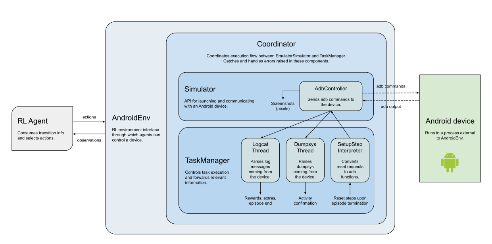

# AndroidEnv - Environment features

AndroidEnv is a complex environment that, while offering an almost endless range
of possibilites for RL research and investigation, poses multiple kinds of
challenges simultaneously. In this document we outline AndroidEnv's main
features that render it such a unique learning environment.

## Real-time environment

AndroidEnv is built on top of an emulated Android device, allowing the agent to
communicate with the emulator through touch actions. Android emulators are
created independently from our environment implementation and simulate real
Android devices in the most realistic manner. This simulation runs real-time,
independently of the agent, meaning that the simulaton will not wait for agent
input between frames. This aspect of the environment renders the RL setup
similar to a robotics problem, where the challenges of real-time interaction and
consequent noise in observations have to be overcome. Please note there is
currently no straightforward way to slow down the simulation either.

## Action space


Perhaps one of the most interesting features of AndroidEnv is its large and
complex action interface. The raw action space of the environment consists of a
tuple `(x,y) in [0,1]x[0,1]` determining the location of the action on the
Android screen, and a discrete value `ActionType in {LIFT, TOUCH, REPEAT}`
indicating whether the agent wants to touch the screen at this chosen location
or not. This action space is uniform across all tasks/apps.

**Gestures.** The complexity of the interface arises from the fact that
individual raw actions on their own do not neccessarily trigger a meaningful
change in the environment. Most Android applications are designed such that they
can be controlled/navigated through common touchscreen gestures such as pressing
buttons, swiping, scrolling, pinching, drag and drop etc. Each of these can be
thought of as particular sequences of raw actions: for example, *touching* the
screen at a particular location, then immediately *lifting* the imaginary finger
might be interpreted as a *press of a button*; while a sequence of *touches*
aligned in a vertical line might be interpreted as *scrolling*. We note that
AndroidEnv does not support multitouch actions at the moment, but it is a
possible feature to add.

It is important to point out that it is out of the environment's control to
determine how particular sequences of raw actions get interpreted by the Android
simulator - much like when humans interact with physical devices, a certain
gesture on the screen might be interpreted differently if it is performed at a
slightly different angle or speed.

Tap                                                      | Double Tap                                                             | Touch & Hold                                                             | Flick Left                                                             | Flick Right                                                              | Scroll (H)                                                                           | Scroll (V)                                                                       | Drag & Drop
-------------------------------------------------------- | ---------------------------------------------------------------------- | ------------------------------------------------------------------------ | ---------------------------------------------------------------------- | ------------------------------------------------------------------------ | ------------------------------------------------------------------------------------ | -------------------------------------------------------------------------------- | -----------
 |  |  |  |  |  |  | 

**Wrappers.** It is possible to alter the raw action space of the environment by
applying [wrappers](#wrappers). For example one might discretize the action
space by splitting the screen up into a grid of a desired size; restrict the
ActionType to *touch* only; or fix certain gesture skills. We note here that
these wrappers, again, will not alter how the particular sequence of performed
raw actions gets interpreted by the Android simulator.

## Observation space

The observation space of AndroidEnv consists of three main components:
(`pixels`, `timedelta`, `orientation`), the most notable of these being
`pixels`. The original screen size will depend on the type of emulator used, but
given that it will correspond to real device screen sizes, this will usually be
quite large (of course, this can be scaled down, e.g. with wrappers). The
`timedelta` component captures the amount of time passed since the last
observation was fetched. The `orientation`, even though it does not affect the
layout of the RGB image in the observation, might carry relevant information for
the agent. For example, if there is text on the screen, it is important to know
how it is oriented. Again, a benefit of this observation space is that it is
uniform across all tasks. As mentioned above, observations often carry spatial
cues and are suggestive of the kind of actions/gestures that are meaningful to
perform in a given state.

## Task extras

On top of the default observations (`pixels`, `timedelta`, `orientation`), some
tasks might expose additional structured observations after each step. An
*extra* in AndroidEnv is any information that an app may send to aid the
understanding of the task. The type of information sent through this channel is
usually something difficult to obtain from raw pixels and may include meaningful
information such as:

*   The current board configuration (e.g. of a chess game or of a tetris game)
    in matrix or string form.
*   The position of the avatar in a map.
*   Events such as whether a button was pressed or whether a checkpoint was
    achieved.

Note that these are entirely optional and may not be available at all.

To request extras from the environment, you can call `env.task_extras()` after
each `env.step()`, which will return a dictionary of all the extra observations
observed during the previous step (or an empty dict is there's none available).
For example:

```python
for _ in range(FLAGS.n_steps):

  action = agent.select_action(timestep.observation)
  timestep = env.step(action)
  logging.info('observation: %s', timestep.observation)
  logging.info('extra observations: %s', env.task_extras())
```

Please note however that the env might not return extras at every timestep, only
when something meaningful happened (e.g. only when a button was pressed, or when
the state of the board has changed).

When integrating your own APK as a new task for the environment, you can define
your own extras by following the instructions
[here](tasks_guide.md#log-messages-and-custom-apks).

## Wrappers

AndroidEnv's action- and observation spaces can be altered by applying suitable
wrappers. While custom wrappers can be built easily, we have provided a number
of useful wrappers that demonstrate their usage:

*   `discrete_action_wrapper`: Discretizes the action space into an `nxk` grid.
*   `flat_interface_wrapper`: Removes the dictionary structure from the
    observation and action specs.
*   `float_pixels_wrapper`: Projects the pixel RGB values from the integer range
    `[0, 255]` to the float range `[0, 1]`.
*   `image_rescale_wrapper`: Resizes the pixel observations by the selected
    ratio.
*   `gym_wrapper`: Changes the environment interface from
    [dm_env](https://github.com/deepmind/dm_env) to
    [OpenAI](https://gym.openai.com/) gym interface.
*   `last_action_wrapper`: Extends the observation with a one-hot encoded
    location of the previously taken action, in order to aid agents without
    built-in memory.

## Internal structure of AndroidEnv

The chart below gives an overview of the internal workings of the system,
illustrating how different classes interact with each other and what their
individual roles are. See the source code for more details.


