# AndroidEnv - Available tasks

This page gives a detailed overview of the example tasks provided with
AndroidEnv. The purpose is to give researchers an idea of the different kinds of
challenges that AndroidEnv poses.

To use any of these tasks in your own experiments, click on the Download icon to
download a zip file containing textprotos and the corresponding APKs. After
downloading, move the `.apk` and `.textproto` files to a directory of your
choice and take note of their path. This information is needed for
[running](instructions.md#create-the-env) an AndroidEnv instance with the given
task.

<!-- mdformat off(multi-line tables are not supported well) -->

| App / Game                                          | Interface            | Time reactive  | Multi-level                   |  Rewards   | Extras  | Download |
| --------------------------------------------------- | -------------------- | -------------- | ----------------------------- | ---------- | ------------ | -------- |
| [Vokram (MDP)](#vokram)                             | Tapping (buttons)    | No             | Yes (4 variants)              | Dense      | Yes          |  |
| [Apple Flinger](#apple-flinger)                     | Drag & drop          | No             | Yes (6 variants)              | Dense      | No           |  |
| [Blockinger](#blockinger)                           | Tapping (buttons)    | Yes            | No                            | Sparse     | Yes          |  |
| [Catch](#catch)                                     | Touch                | Yes            | No                            | Dense      | Yes          |  |
| [Classic 2048](#classic-2048)                       | Swiping              | No             | No                            | Dense      | Yes          |  |
| [Dodge](#dodge)                                     | Tapping              | Yes            | No                            | Sparse     | Yes          |   |
| [DroidFish (Chess)](#droidfish)                     | Tapping              | No             | Yes (3 levels)                | Sparse     | Yes          |  |
| [FlappyDroid](#flappydroid)                         | Tapping              | Yes            | Yes (2 levels)                | Dense      | No           |   |
| [Frozen Bubble](#frozen-bubble)                     | Dragging, tapping    | No             | No                            | Sparse     | No           |  |
| [Memory Game](#memory-game)                         | Tapping              | No             | Yes (6 levels)                | Sparse     | Yes          |  |
| [Minesweeper](#minesweeper)                         | Tapping              | No             | Yes (3 levels)                | Sparse     | Yes          |  |
| [Open Sudoku](#open-sudoku)                         | Tapping (buttons)    | No             | Yes (3 levels)                | Sparse     | Yes          |  |
| [Perfection](#perfection)                           | Drag & drop          | No             | Yes (3 game types)            | Dense      | Yes          |   |
| [Rocket Sleigh](#rocket-sleigh)                     | Tapping              | Yes            | No                            | Dense      | No           |  |
| [Pong](#pong)                                       | Drag                 | Yes            | Yes (3 levels)                | Sparse     | Yes          |    |
| [SGT Puzzles - Blackbox](#sgt-puzzles-blackbox)     | Tapping              | No             | Yes (4 levels)                | Sparse     | Yes          |  |
| [SGT Puzzles - Bridge](#sgt-puzzles-bridge)         | Drag & drop          | No             | Yes (5 levels)                | Sparse     | Yes          |  |
| [SGT Puzzles - Cube](#sgt-puzzles-cube)             | Tapping              | No             | Yes (3 levels)                | Sparse     | Yes          |   |
| [SGT Puzzles - Dominosa](#sgt-puzzles-dominosa)     | Tapping              | No             | Yes (5 levels)                | Sparse     | Yes          |   |
| [SGT Puzzles - Fifteen](#sgt-puzzles-fifteen)       | Tapping              | No             | Yes (4 levels)                | Sparse     | Yes          |  |
| [SGT Puzzles - Flip](#sgt-puzzles-flip)             | Tapping              | No             | Yes (3 levels)                | Sparse     | Yes          |  |
| [SGT Puzzles - Flood](#sgt-puzzles-flood)           | Tapping              | No             | Yes (3 levels)                | Sparse     | Yes          |  |
| [SGT Puzzles - Galaxies](#sgt-puzzles-galaxies)     | Tapping              | No             | Yes (6 sizes)                 | Sparse     | Yes          |  |
| [SGT Puzzles - Guess](#sgt-puzzles-guess)           | Tapping              | No             | Yes (4 levels)                | Sparse     | Yes          |  |
| [SGT Puzzles - Inertia](#sgt-puzzles-inertia)       | Tapping              | No             | Yes (2 sizes)                 | Sparse     | Yes          |  |
| [SGT Puzzles - Light Up](#sgt-puzzles-light-up)     | Tapping              | No             | Yes (5 sizes)                 | Sparse     | Yes          |  |
| [SGT Puzzles - Loopy](#sgt-puzzles-loopy)           | Tapping              | No             | Yes (3 sizes)                 | Sparse     | Yes          |  |
| [SGT Puzzles - Net](#sgt-puzzles-net)               | Tapping              | No             | Yes (5 sizes)                 | Sparse     | Yes          |  |
| [Shattered Pixel Dungeon](#shattered-pixel-dungeon) | Tapping              | Yes            | Yes (4 variants)              | Sparse     | No           |  |
| [Simple Solitaire](#simple-solitaire)               | Drag & drop          | No             | Yes (19 tasks)                | Sparse     | Yes          |  |
| [Snake](#snake)                                     | Tapping (buttons)    | Yes            | No                            | Sparse     | Yes          |  |
| [Vector Pinball](#vector-pinball)                   | Tapping              | Yes            | Yes (5 variants)              | Sparse     | No           |  |

<!-- mdformat on -->

## Vokram

Vokram is our in-house implementation of an Android app that displays a
Markov-Decision-Process (MDP) graph as buttons on the screen which the agent
must use to select its actions. The observation is simply the color of the
background, and the actions are the buttons themselves which are presented in
different colors.

*   **mdp_0000**: This is a task that presents the agent with two colored, but
    unlabeled buttons on the screen. Pressing one of the buttons gives the agent
    a reward of `-1` and redraws the buttons on the screen. The other button
    gives a reward of `+1` and terminates the episode. The color of the buttons
    is the same throughout the episode. The sizes of the buttons are randomized
    at each screen draw. Pressing anywhere else on the screen gives a reward of
    zero. The task lasts up 60 seconds, at which point the episode is restarted.
    The underlying dynamics governing the buttons is a simple 2-state 2-action
    Markov Decision Process (MDP). The MDP is intentionally simple environment
    that can be used to debug agents.

*   **mdp_0001**: This is similar to `mdp_0000` but it's even simpler. It
    presents the agent with a single button which gives a reward of `+1` and
    terminates the episode when pressed. This task can be used for example to
    train agents to click buttons.

*   **mdp_0002**: In this task there are two buttons, pressing either of which
    will terminate the episode with a return of `+1`.

*   **mdp_0003**: An equivalent of `mdp_0000` with rewards reversed: the episode
    ends when the wrong button is clicked, and carries on with a new set of
    buttons when the correct one is clicked.

  
Extras returned

*   `actions`:
    -   Set of all buttons present, e.g. `['A', 'B']`.
    -   Returned when any button is pressed.
    -   Has `shape=[2], dtype=STRING_U1`.
*   `clicks`:
    -   Character representing the button pressed.
    -   Returned when any button is pressed.
    -   Has `shape=[1], dtype=STRING_U1`.
*   `buttons`:
    -   Coordinates of the top left and bottom right corners of each button, e.g
        `[[x_a_0, y_a_0, x_a_1, y_a_1], [x_b_0, y_a_0, x_b_1, y_b_1]]`.
    -   Returned when any button is pressed.
    -   Has `shape=[2, 4], dtype=INT32`.

**mdp_0000**                                     | **mdp_0001**                                     | **mdp_0002**                                     | **mdp_0003**
------------------------------------------------ | ------------------------------------------------ | ------------------------------------------------ | ------------
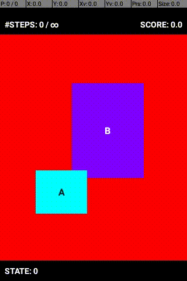 |  |  | 

## Apple Flinger

A clone of Angry Birds. Even though the game offers many levels, we currently
expose six levels. See the original github repo for more info:
https://gitlab.com/ar-/apple-flinger.

  
Extras returned

  Returns no extras.

**apple_flinger_M_1_1**                                                | **apple_flinger_M_1_2**                                                | **apple_flinger_M_1_18**
---------------------------------------------------------------------- | ---------------------------------------------------------------------- | ------------------------
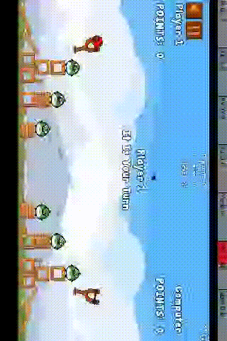 |  | 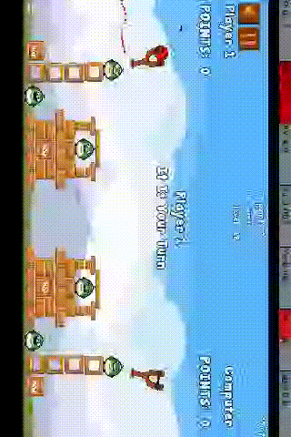

**apple_flinger_M_2_1**                                                 | **apple_flinger_M_2_2**                                                | **apple_flinger_M_2_18**
----------------------------------------------------------------------- | ---------------------------------------------------------------------- | ------------------------
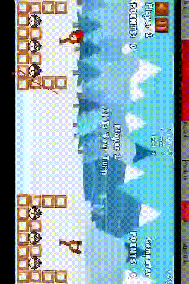) | 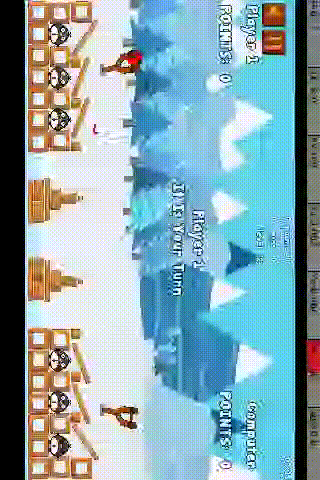 | 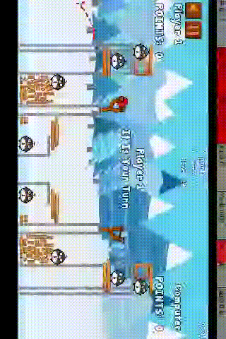

## Blockinger

This is a Tetris clone implemented with on-screen controls. See the original
github repo for more info: https://github.com/tasioleiva/Blockinger.git.

  
Extras returned

*   `down_pressed`, `left_pressed`, `right_pressed`, `rotate_right_pressed`,
    `drop_pressed`:
    -   Indicates that said button has been pressed.
    -   Returned when said button has been pressed.
    -   Has `shape=[1], dtype=INT32`.
*   `current_board`:
    -   One-hot encoded state of the board.
    -   Has `shape=[18, 10], dtype=INT32`.
*   `current_line`, `cleared_lines`:
    -   Index of the relevant line.
    -   Has `shape=[1], dtype=INT32`.
*   `current_piece`, `next_piece`:
    -   Index representing the type of piece.
    -   Has `shape=[1], dtype=INT32`.

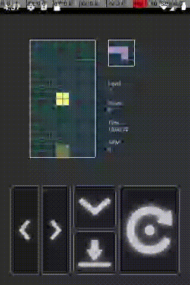

## Catch

Classic Catch game.

  
Extras returned

*   `ball`:
    -   `x, y` coordinates of the ball.
    -   Returned every timestep.
    -   Has `shape=[2], dtype=INT32`.
*   `paddle`:
    -   `x, y` coordinates of the paddle.
    -   Returned every timestep.
    -   Has `shape=[2], dtype=INT32`.
*   `paddle_width`:
    -   Width of the paddle.
    -   Returned every timestep.
    -   Has `shape=[1], dtype=INT32`.
*   `lives`:
    -   Number of lives left.
    -   Returned every timestep.
    -   Has `shape=[1], dtype=INT32`.

## Classic 2048

This is an Android implementation of a popular game in the 2010s. See the
original github repo for more info: https://github.com/tpcstld/2048.git.

  
Extras returned

*   `grid`:
    -   State of the board.
    -   Returned when the board changes.
    -   Has `shape=[4, 4], dtype=INT32`.
*   `direction`:
    -   Index representing the direction of the last swipe (between 0-3).
    -   Returned when the swipe prompted a board change.
    -   Has `shape=[1], dtype=INT32`.

## Dodge

Guide the ball from the red line to the green line without getting hit by the
floating dots.

  
Extras returned

*   `lives`:
    -   Number of lives left.
    -   Returned when its value changes.
    -   Has `shape=[1], dtype=INT32`.
*   `level`:
    -   Current level.
    -   Returned when its value changes.
    -   Has `shape=[1], dtype=INT32`.

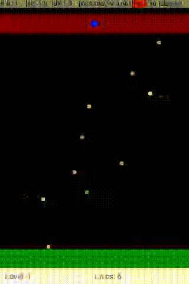

## DroidFish

Standard chess game. You can choose whether to play as a specific player
(black/white), or have the player colour randomly assigned at the beginning of
each episode. The numbers 1, 10 and 100 indicate the level of difficulty. Take a
look at a few sample moves below to get an idea of roughly how well the bot
plays for each level of difficulty. You can see that the 1% and 10% bots often
make very obvious mistakes. See the original github repo for more info:
https://github.com/peterosterlund2/droidfish.

  
Extras returned

*   `board`:
    -   State of the board, representing pieces by indices. No piece - 0
    -   White pieces - 1: king, 2: queen, 3: rook, 4: bishop, 5: knight, 6: pawn
    -   Black pieces - 7: king, 8: queen, 9: rook, 10: bishop, 11: knight, 12:
        pawn
    -   Returned when the board changes.
    -   Has `shape=[8, 8], dtype=INT32`.
*   `selection`:
    -   Coordinate of selected piece (between 0-64, -1 if selection is removed)
    -   Returned when a piece is selected (or unselected).
    -   Has `shape=[1], dtype=INT32`.
*   `moved`:
    -   Coordinates "from" and "to" cells when a piece is moved (between 0-64)
    -   Returned when a piece is moved.
    -   Has `shape=[2], dtype=INT32`.
*   `invalid`:
    -   Coordinates "from" and "to" cells of an invalid move attempt (between
        0-64)
    -   Returned upon invalid move request
    -   Has `shape=[2], dtype=INT32`.

**droidfish_black_1**                                              | **droidfish_black_10**                                               | **droidfish_black_100**
------------------------------------------------------------------ | -------------------------------------------------------------------- | -----------------------
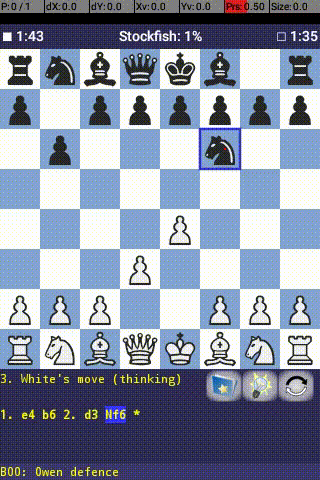 | 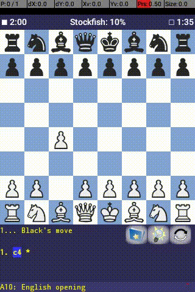 | 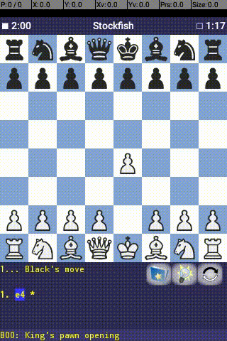

**droidfish_white_1**                                              | **droidfish_white_10**                                               | **droidfish_white_100**
------------------------------------------------------------------ | -------------------------------------------------------------------- | -----------------------
 | 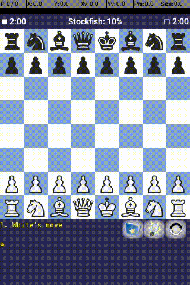 | 

**droidfish_random_1**                                               | **droidfish_random_10**                                                | **droidfish_random_100**
-------------------------------------------------------------------- | ---------------------------------------------------------------------- | ------------------------
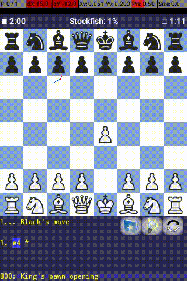 |  | 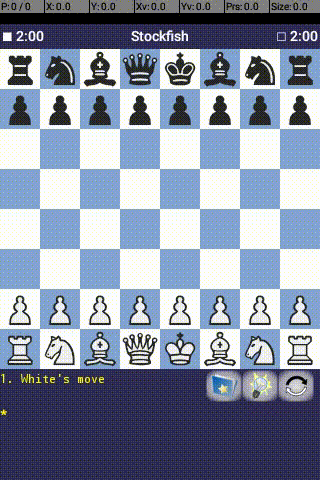

## FlappyDroid

A clone of the well-known game Flappy Birds.

  
Extras returned

  Returns no extras.

**systemui_egg_land_default**                                                      | **systemui_egg_land_half_speed**
---------------------------------------------------------------------------------- | --------------------------------
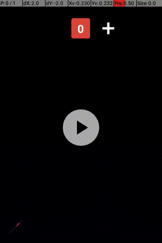 | 

## Frozen Bubble

Shoot the coloured bubbles in a direction of your choice. Groups of bubbles with
the same colour will drop. Remove all bubbles from the board before the time
runs out. See the original github repo for more info:
https://github.com/robinst/frozen-bubble-android.git.

  
Extras returned

  Returns no extras.

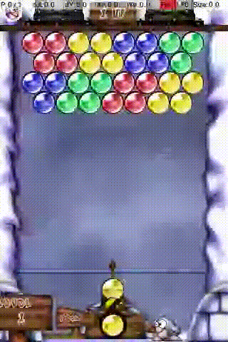

## Memory Game

Classic memory game. Find the pairs of images. See the original github repo for
more info: https://github.com/sromku/memory-game/.

  
Extras returned

*   `flip`:
    -   Index of the card flipped
    -   Returned when a card is clicked.
    -   Has `shape=[1], dtype=INT32`.
*   `cards`:
    -   Number of cards still on the board.
    -   Returned upon finding a pair.
    -   Has `shape=[1], dtype=INT32`.
*   `remained`:
    -   Number of cards remaining at the end of the episode.
    -   Returned when an episode is over.
    -   Has `shape=[1], dtype=INT32`.
*   `stars`:
    -   Number of stars achieved at the end of the game.
    -   Returned upon finishing the game.
    -   Has `shape=[1], dtype=INT32`.
*   `achieved`:
    -   Score obtained by the end of the episode.
    -   Returned when an episode is over.
    -   Has `shape=[1], dtype=INT32`.

**memory_game_animals_beginner**                                                         | **memory_game_animals_easy**                                                     | **memory_game_monsters_medium**
---------------------------------------------------------------------------------------- | -------------------------------------------------------------------------------- | -------------------------------
 |  | 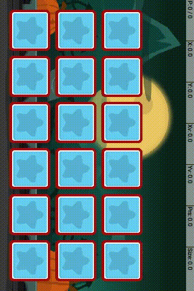

**memory_game_monsters_hard**                                                      | **memory_game_emojis_hardest**                                                       | **memory_game_emojis_master**
---------------------------------------------------------------------------------- | ------------------------------------------------------------------------------------ | -----------------------------
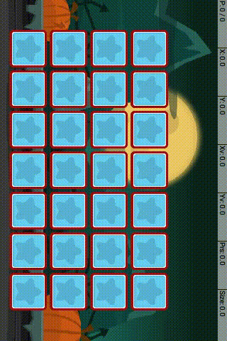 |  | 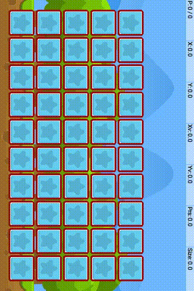

## Minesweeper

This is an Android implementation of a popular game on Desktop in the 1990s. See
the original github repo for more info: https://gitlab.com/ar-/apple-flinger.

  
Extras returned

*   `hidden`:
    -   Number of hidden cells.
    -   Returned whenever the board changes.
    -   Has `shape=[1], dtype=INT32`.
*   `revealed`:
    -   Number of revealed cells.
    -   Returned whenever the board changes.
    -   Has `shape=[1], dtype=INT32`.
*   `bombs`:
    -   Number of bombs in the game.
    -   Returned whenever the board changes.
    -   Has `shape=[1], dtype=INT32`.
*   `click`:
    -   Coordinates of the cell clicked (row, column).
    -   Returned whenever the board changes.
    -   Has `shape=[2], dtype=INT32`.
*   `grid`:
    -   State of the board.
    -   -1 = hidden, -2 = marked, 9 = bomb, 0-8 = number of nearby bombs
    -   Returned whenever the board changes.
    -   Has `shape=[grid_height, grid_width], dtype=INT32`.

**minesweeper_easy**                                             | **minesweeper_medium**                                               | **minesweeper_hard**
---------------------------------------------------------------- | -------------------------------------------------------------------- | --------------------
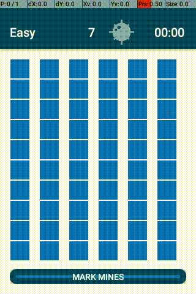 | 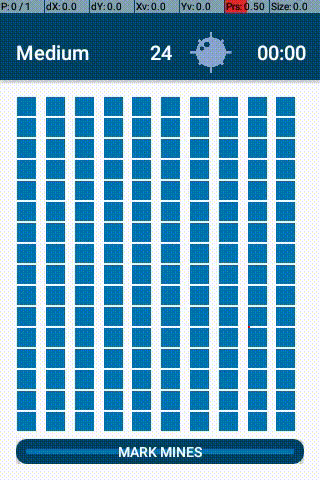 | 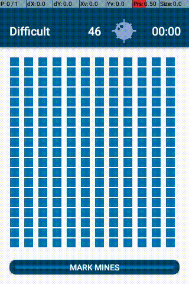

## Open Sudoku

Classic Sudoku game with different levels of difficulty. The board is randomised
over a set of 30 boards for each level. See the original github repo for more
info: https://github.com/ogarcia/opensudoku.

  
Extras returned

*   `value`:
    -   Number pressed (between 1-9, 0 if the "delete" button is pressed).
    -   Returned upon clicking said button.
    -   Has `shape=[1], dtype=INT32`.

**open_sudoku_easy**                                             | **open_sudoku_medium**                                               | **open_sudoku_hard**
---------------------------------------------------------------- | -------------------------------------------------------------------- | --------------------
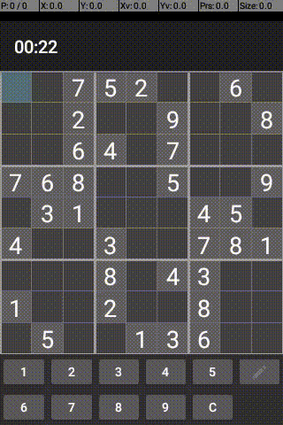 |  | 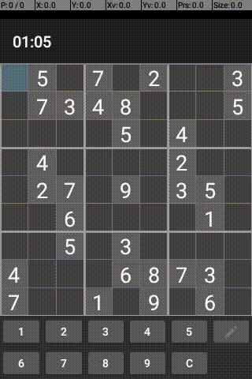

## Perfection

Drag the items corresponding to the targets with the same shape.

  
Extras returned

*   `moving`:
    -   The ID of the piece being dragged on the screen or 0.
    -   Returned when its value changes.
    -   Has `shape=[1], dtype=INT32`.
*   `todo`:
    -   Number of pieces yet to be moved to a hole.
    -   Returned when its value changes.
    -   Has `shape=[1], dtype=INT32`.
*   `done`:
    -   Number of pieces correctly moved to a hole.
    -   Returned when its value changes.
    -   Has `shape=[1], dtype=INT32`.

**perfection_1_circle_static**                                                       | **perfection_1_cube_static**                                                         | **perfection_1_plus_static**                                                     | **perfection_1_triangle_static**
------------------------------------------------------------------------------------ | ------------------------------------------------------------------------------------ | -------------------------------------------------------------------------------- | --------------------------------
 | 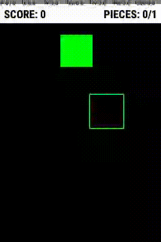 | 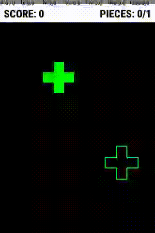 | 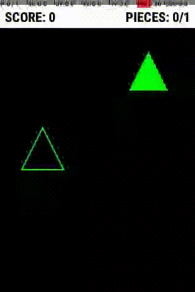

**perfection_default**                                               | **perfection_4_colors_square_static**                                                              | **perfection_4_pieces_static**
-------------------------------------------------------------------- | -------------------------------------------------------------------------------------------------- | ------------------------------
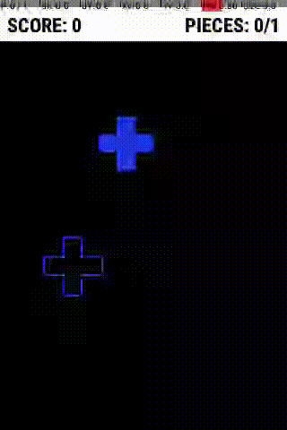 | 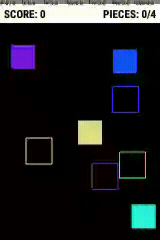 | 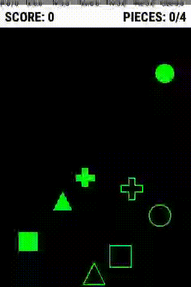

## Rocket Sleigh

A Flappy Bird-like game where you have to collect christmas presents while
avoiding trees. The sleigh is powered by a rocket that needs to recharge over
time after you use up its fuel.

  
Extras returned

  Returns no extras.

## Pong

Classic Pong game.

  
Extras returned

*   `ball`:
    -   The ball coordinates: [left, top, right, bottom].
    -   Returned when its value changes.
    -   Has `shape=[4], dtype=INT32`.
*   `computer`:
    -   The computer paddle coordinates: [left, top, right, bottom].
    -   Returned when its value changes.
    -   Has `shape=[4], dtype=INT32`.
*   `human`:
    -   The human paddle coordinates: [left, top, right, bottom].
    -   Returned when its value changes.
    -   Has `shape=[4], dtype=INT32`.
*   `collision`:
    -   Indicates collision of paddle and ball: (0=no collision, 1=collision).
    -   Returned when its value changes.
    -   Has `shape=[1], dtype=INT32`.
*   `state`:
    -   The current state of the game: (0=pause, 1=ready, 2=running, 3=lose,
        4=win).
    -   Returned when its value changes.
    -   Has `shape=[1], dtype=INT32`.

**pong_easy**                                      | **pong_default**                                         | **pong_hard**
-------------------------------------------------- | -------------------------------------------------------- | -------------
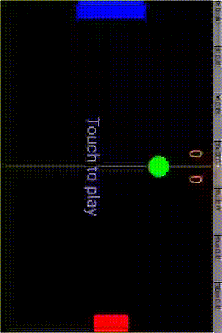 | 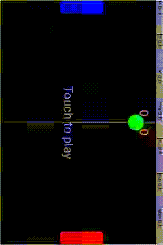 | 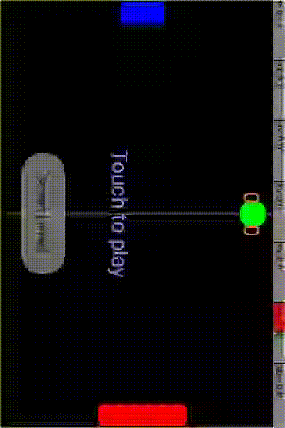

## SGT Puzzles - Blackbox

There's an invisible laser beam originating from each of the cells at the edge
of the grid. There are also a given number of balls inside the grid, hidden from
the player whose aim is to guess where those balls are. The player can figure
out where those balls might be by looking at how they *deflect* the laser beams.
Clicking on an edge cell the player can reveal information about how that
particular laser beam travels. Click on a cell; if the cell reveals an `H`, it
means the straight laser beam leaving this cell hits a ball frontally. If the
cell reveals a *number* along with another cell with the same number, that means
the laser beam originating in the first cell ends up getting absorbed in the
corresponding pair cell. If the cell reveals an `R`, that means the laser beam
was *reflected*: either its origin and the cell it gets absorbed in is the
*same*, or the beam gets bent before entering the grid. See the description
below.

The balls affect the travel of the laser beam in the following way:

*   If a laser beam hits it straight, it gets absorbed. This is denoted by the
    letter `H`.
*   If a laser beam hits *its corner*, the beam gets deflected by 90 degrees.
*   If a laser beam hits a balls corner right at the edge of the grid, i.e.
    before it enters the grid, it is considered *reflected*.
*   If a laser beam enters the same cell that it originally left, it is
    considered *reflected* too.

Once the player has placed the given number of balls on the screen, a green dot
appears that allows the player to check if their solution was correct. See the
original github repo for more info: https://github.com/chrisboyle/sgtpuzzles.

  
Extras returned

*   `balls`:
    -   The number of balls in the game arena.
    -   Returned whenever the grid changes.
    -   Has `shape=[1], dtype=INT32`.
*   `guesses`:
    -   The number of guessed balls made by the agent.
    -   Returned whenever the grid changes.
    -   Has `shape=[1], dtype=INT32`.
*   `wrong`:
    -   1 if the guesses are wrong, 0 otherwise.
    -   Returned whenever the grid changes.
    -   Has `shape=[1], dtype=INT32`.
*   `lasers`:
    -   The number of lasers in the grid
    -   Returned whenever the grid changes.
    -   Has `shape=[1], dtype=INT32`.
*   `grid`:
    -   Representation of the grid cells:
    -   In the arena: `G`=guessed ball `' '`=empty
    -   In the range: `[0-9]`=the number of lasers, `H`=beam hit, `R`=beam
        reflected,
    -   `?` unknown, `' '` for the corners
    -   Returned whenever the grid changes.
    -   Has `shape=[grid_size, grid_size], dtype=STRING_U1`.

**blackbox_3x3_1_ball**                                                           | **blackbox_5x5_3_balls**                                                            | **blackbox_8x8_5_balls**                                                            | **blackbox_10x10_5_balls**
--------------------------------------------------------------------------------- | ----------------------------------------------------------------------------------- | ----------------------------------------------------------------------------------- | --------------------------
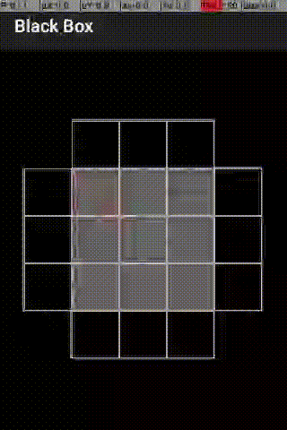 | 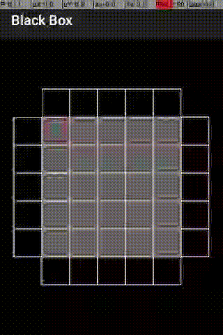 | 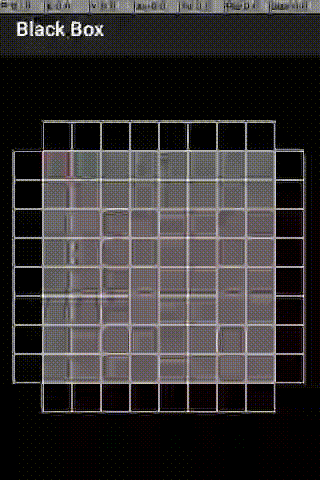 | 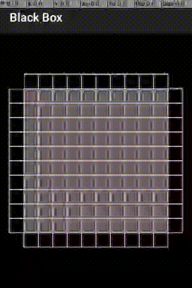

## SGT Puzzles - Bridge

Connect nodes on the board so that each number denotes the degree of the given
vertex. Edges are not allowed to cross each other and the graph has to be
connected. Edges have to be horizontal or vertical, and there can be at most two
parallel bridges between any pair of nodes. See the original github repo for
more info: https://github.com/chrisboyle/sgtpuzzles.

  
Extras returned

*   `islands`:
    -   Number of nodes on the board.
    -   Returned whenever the grid changes.
    -   Has `shape=[1], dtype=INT32`.
*   `grid`:
    -   Representation of the current state of the board.
    -   `[0-9]=island, ' '=empty`
    -   `'|'=vertical line, '"'=double vertical line, '!'=wrong vertical line`
    -   `'-'=horizontal line, '='=double horizontal line, '~'=wrong horizontal
        line`
    -   Returned whenever the grid changes.
    -   Has `shape=[grid_size, grid_size], dtype=STRING_U1`.

**bridge_7x7_easy**                                                                  | **bridge_7x7_medium**                                                                    | **bridge_7x7_hard**                                                                  | **bridge_10x10_medium**                                                                      | **bridge_15x15_medium**
------------------------------------------------------------------------------------ | ---------------------------------------------------------------------------------------- | ------------------------------------------------------------------------------------ | -------------------------------------------------------------------------------------------- | -----------------------
 |  | 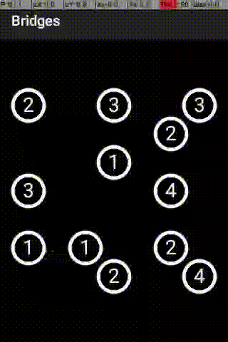 | 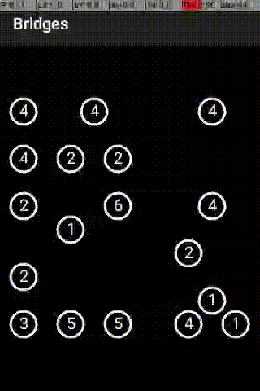 | 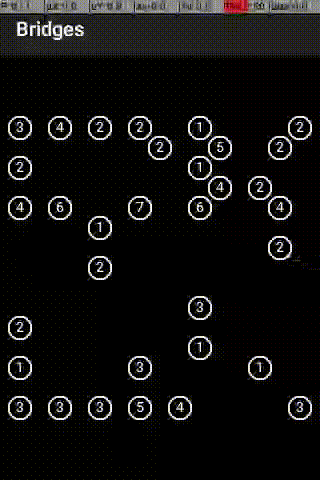

## SGT Puzzles - Cube

There are six coloured squares that you have to collect with a moving cube. If
the cube rolls on top of a coloured cell, the colour gets attached to that side
of the cube; and if a coloured side of the cube rolls on an empty cell, the
colour is removed from the cube. The goal is to have all six sides of the cube
coloured. See the original github repo for more info:
https://github.com/chrisboyle/sgtpuzzles.

  
Extras returned

*   `current`:
    -   Index of the current grid cell the cube is on.
    -   Returned whenever the cube moves.
    -   Has `shape=[1], dtype=INT32`.
*   `previous`:
    -   Index of the previous grid cell the cube was on.
    -   Returned whenever the cube moves.
    -   Has `shape=[1], dtype=INT32`.
*   `grid`:
    -   The grid state (0 = dark, 1 = blue)
    -   Returned whenever the cube moves.
    -   Has `shape=[grid_size, grid_size], dtype=INT32`.
*   `face_count`:
    -   The number of dark faces on the cube.
    -   Returned whenever the cube moves.
    -   Has `shape=[1], dtype=INT32`.
*   `face_colour_count`:
    -   The number of blue faces on the cube.
    -   Returned whenever the cube moves.
    -   Has `shape=[1], dtype=INT32`.
*   `faces`:
    -   The cube faces (0 = dark, 1 = blue)
    -   Returned whenever the cube moves.
    -   Has `shape=[6], dtype=INT32`.

**cube_c3x3**                                                            | **cube_c4x4**                                                            | **cube_c8x8**
------------------------------------------------------------------------ | ------------------------------------------------------------------------ | -------------
 | 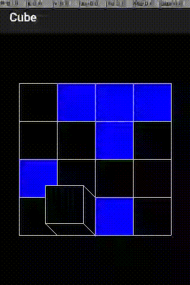 | 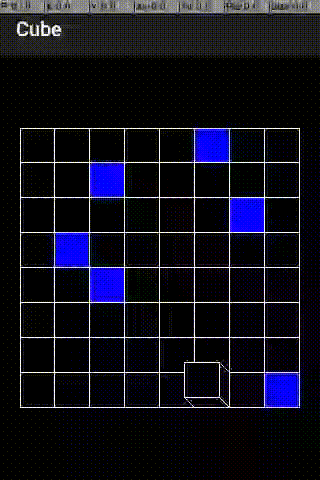

## SGT Puzzles - Dominosa

Place 2x1 size dominoes on the board such that the full board is covered, making
sure that no two dominoes have the same pair of numbers on them. There needs to
be exactly one of (0, 0), (0, 1) (0, 2), ... (1, 1), (1, 2) etc. See the
original github repo for more info: https://github.com/chrisboyle/sgtpuzzles.

  
Extras returned

*   `numbers`:
    -   Numbers as they appear in the grid.
    -   Returned whenever the grid changes.
    -   Has `shape=[height, width], dtype=INT32`.
*   `grid`:
    -   Letters representing the dominoes currently placed on the board.
    -   'R=right, L=left, T=top, B=bottom'
    -   Returned whenever the grid changes.
    -   Has `shape=[height, with], dtype=INT32`.
*   `clash`:
    -   Represents clashes on the board (i.e. if two dominoes have the same
        pair)
    -   '1=clash, 0=no clash'
    -   Returned whenever the grid changes.
    -   Has `shape=[height, width], dtype=INT32`.

**dominosa_1**                                                             | **dominosa_3**                                                             | **dominosa_3a**                                                              | **dominosa_6**                                                             | **dominosa_9**
-------------------------------------------------------------------------- | -------------------------------------------------------------------------- | ---------------------------------------------------------------------------- | -------------------------------------------------------------------------- | --------------
 |  |  | 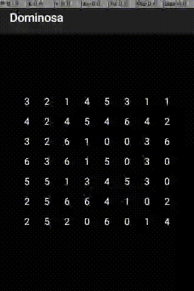 | 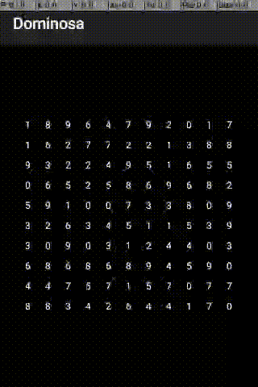f

## SGT Puzzles - Fifteen

Order the tiles in increasing order, starting from the top left corner. See the
original github repo for more info: https://github.com/chrisboyle/sgtpuzzles.

  
Extras returned

*   `grid`:
    -   Current state of the grid.
    -   Returned whenever the grid changes.
    -   Has `shape=[grid_size, grid_size], dtype=INT32`.
*   `empty`:
    -   Index of the single empty cell in the grid.
    -   Returned whenever the grid changes.
    -   Has `shape=[1], dtype=INT32`.
*   `movecount`:
    -   Number of moves made so far.
    -   Returned whenever the grid changes.
    -   Has `shape=[1], dtype=INT32`.

**fifteen_2x2**                                                              | **fifteen_3x3**                                                              | **fifteen_4x4**                                                              | **fifteen_6x6**
---------------------------------------------------------------------------- | ---------------------------------------------------------------------------- | ---------------------------------------------------------------------------- | ---------------
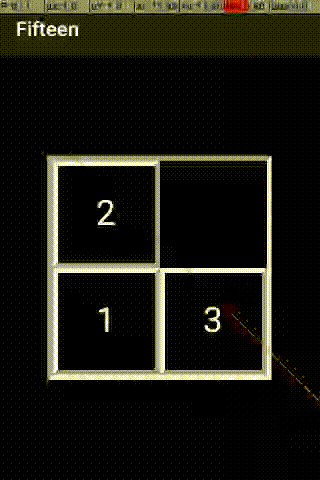 | 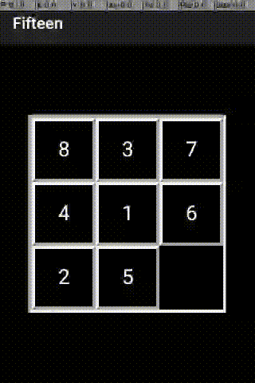 | 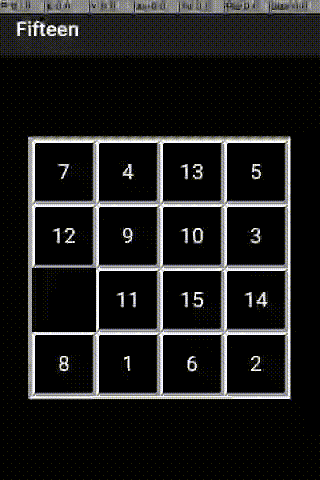 | 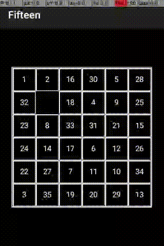

## SGT Puzzles - Flip

Clicking on a cell will flip the colour of some of its neighbours, which are
determined by the symbol in the cell. The goal is to make all the cells have the
same colour. See the original github repo for more info:
https://github.com/chrisboyle/sgtpuzzles.

  
Extras returned

*   `light`:
    -   The number of light cells.
    -   Returned whenever the grid changes.
    -   Has `shape=[1], dtype=INT32`.
*   `dark`:
    -   The number of dark cells
    -   Returned whenever the grid changes.
    -   Has `shape=[1], dtype=INT32`.
*   `moves`:
    -   The number of moves made by the player.
    -   Returned whenever the grid changes.
    -   Has `shape=[1], dtype=INT32`.
*   `grid`:
    -   State of the board (0 = dark, 1 = light).
    -   Returned whenever the grid changes.
    -   Has `shape=[grid_size, grid_size], dtype=INT32`.
*   `gridMatrix`:
    -   The grid matrix of square neighbours (-1 = outside, 1 = neighbour, 0 =
        not neighbour)
    -   Returned whenever the grid changes.
    -   Has `shape=[grid_size, grid_size, 3, 3s], dtype=INT32`.

**flip_3x3c**                                                            | **flip_4x4c**                                                            | **flip_5x5r**
------------------------------------------------------------------------ | ------------------------------------------------------------------------ | -------------
 |  | 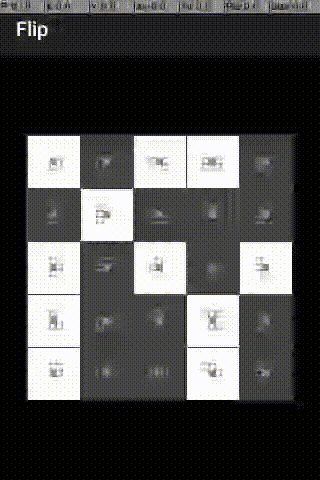

## SGT Puzzles - Flood

FloodIt is a game where the player needs to fill the board with a single color.
The dynamics of the game are driven by colored areas of the board, which when
pressed cause the currently active region to change its color to the color of
the pressed button. When this active region changes color it absorbs neighboring
squares that have the same color, thus expanding the active region. The active
region starts as a single square at the top-left corner of the board. The game
gives a single reward at the end of the game if the player manages to fill the
entire board with the same color within the maximum number steps, otherwise the
reward is just zero. See the original github repo for more info:
https://github.com/chrisboyle/sgtpuzzles.

  
Extras returned

*   `board`:
    -   State of the board, representing colours by their indices.
    -   0: red, 1: yellow, 2: green, 3: blue, 4: orange, 5: purple,
    -   6: brown, 7: light blue, 8: light green, 9: pink
    -   Returned whenever the grid changes.
    -   Has `shape=[grid_size, grid_size], dtype=INT32`.

**sgtpuzzles_flood_3x3_easy**                                                      | **sgtpuzzles_flood_12x12_medium**                                                          | **sgtpuzzles_flood_16x16_hard**
---------------------------------------------------------------------------------- | ------------------------------------------------------------------------------------------ | -------------------------------
 |  | 

## SGT Puzzles - Galaxies

Split the grid up into centrally symmetric areas. The centre of symmetry for
each area is denoted by a dot on the grid. See the original github repo for more
info: https://github.com/chrisboyle/sgtpuzzles.

  
Extras returned

*   `dot`:
    -   Number of dots on the board.
    -   Returned whenever the grid changes.
    -   Has `shape=[1], dtype=INT32`.
*   `grid`:
    -   String representation of the board:
    -   `o`=dot, `' '`=empty, `+`, `-`, `|` = cell corners.
    -   Returned whenever the grid changes.
    -   Has `shape=[grid_size, grid_size], dtype=STRING_U1`.

**galaxies_3x3_normal**                                                           | **galaxies_5x5_normal**                                                           | **galaxies_7x7_normal**
--------------------------------------------------------------------------------- | --------------------------------------------------------------------------------- | -----------------------
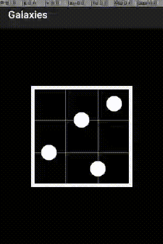 |  | 

**galaxies_7x7_unreasonable**                                                     | **galaxies_10x10_normal**                                                             | **galaxies_15x15_normal**
--------------------------------------------------------------------------------- | ------------------------------------------------------------------------------------- | -------------------------
 |  | 

## SGT Puzzles - Guess

The computer has thought of a sequence of colours that you have to guess. Fill
the top row with colours of your choice, and wait for the computer to give you
feedback about your sequence. It will show a black dot for each colour that is
placed in the correct position, and a white dot for each that is present in the
hidden sequence, but not at the position your guess. Try to figure out the
hidden sequence before you run out of guesses! See the original github repo for
more info: https://github.com/chrisboyle/sgtpuzzles.

  
Extras returned

*   `peg`:
    -   Indices representing the colours selected in the latest row.
    -   Returned after the row is completed and evaluated.
    -   Has `shape=[row_length], dtype=INT32`.
*   `feedback`:
    -   Evaluation of the latest guess (0: incorrect, 1: correct place, 2:
        correct colour)
    -   Returned after the row is completed and evaluated.
    -   Has `shape=[row_length], dtype=INT32`.

**guess_basic**                                                              | **guess_quick**                                                   | **guess_standard**                                                      | **guess_super**
---------------------------------------------------------------------------- | ----------------------------------------------------------------- | ----------------------------------------------------------------------- | ---------------
 |  |  | 

## SGT Puzzles - Inertia

Collect all the blue diamonds on the board without colliding into a bomb. You
can move the ball in the 8 main directions (including the diagonals). The ball
will keep on moving in that direction until it hits a wall, a bomb, a diamond or
a circle. Circles and diamonds have grip, i.e. it will stop the ball from
continuing to move in the direction it was going towards. See the original
github repo for more info: https://github.com/chrisboyle/sgtpuzzles.

  
Extras returned

*   `gems`:
    -   Current number of gems still on the board.
    -   Returned whenever the grid changes.
    -   Has `shape=[1], dtype=INT32`.
*   `distancemoved`:
    -   Number of cells just moved.
    -   Returned whenever the grid changes.
    -   Has `shape=[1], dtype=INT32`.
*   `grid`:
    -   Symbols of grid cells (b=blank, g=gem, m=mine, s=stop, w=wall)
    -   Returned whenever the grid changes.
    -   Has `shape=[grid_size, grid_size], dtype=INT32`.

**inertia_5x5**                                                   | **inertia_10x10**
----------------------------------------------------------------- | -----------------
 | 

## SGT Puzzles - Light Up

You have a grid of squares. Some are empty (black) and some are *walls* (grey);
some of the walls are numbered. Your aim is to *light up* all the empty squares
by placing light bulbs in some of them. The numbers denote how many bulbs' light
hits these directly in a straight sight. Meanwhile, no two bulbs should light up
each other (i.e. only one bulb allowed in straight sight). See the original
github repo for more info: https://github.com/chrisboyle/sgtpuzzles.

  
Extras returned

*   `grid`:
    -   String representation of the board:
    -   '#' = blocked, ' ' = empty/black, 'L' = light, 'l' = illuminated,
    -   'X' = impossible, 'number' = number of bulbs hitting this cell.
    -   Returned whenever the grid changes.
    -   Has `shape=[grid_size, grid_size], dtype=STRING_U1`.

**light_up_3x3_easy**                                                                    | **light_up_5x5_easy**                                                                    | **light_up_7x7_easy**                                                                    | **light_up_10x10_tricky**                                                             | **light_up_14x14_easy**
---------------------------------------------------------------------------------------- | ---------------------------------------------------------------------------------------- | ---------------------------------------------------------------------------------------- | ------------------------------------------------------------------------------------- | -----------------------
 |  |  |  | 

## SGT Puzzles - Loopy

Draw a closed loop along the edges of the grid. A number in a cell denotes the
number of edges adjacent to that cell. The loop cannot intersect itself. See the
original github repo for more info: https://github.com/chrisboyle/sgtpuzzles.

  
Extras returned

*   `grid`:
    -   String representation of the board:
    -   The grid lines and cells:
    -   `.` = dots (cell corners)
    -   `0-9` = number on cell face or ` ` for empty face
    -   `?` = unknown (default),`x` = no line,`-` = `|` = line,`~` = `/` = error
    -   Returned whenever the grid changes.
    -   Has `shape=[grid_size, grid_size], dtype=STRING_U1`.

**loopy_3x3_easy**                                                                 | **loopy_5x5_easy**                                                                 | **loopy_7x7_easy**                                                                 | **loopy_7x7_normal**                                                                   | **loopy_7x7_hard**
---------------------------------------------------------------------------------- | ---------------------------------------------------------------------------------- | ---------------------------------------------------------------------------------- | -------------------------------------------------------------------------------------- | ------------------
 |  |  |  | 

## SGT Puzzles - Net

There are a number of light bulbs, wires and a single light source in the
middle. Connect the wires such that all bulbs are lit up, without loose ends or
loops in the wiring. You can rotate the tiles by clicking on them. If the task
name has a *w* suffix in it then it is allowed to connect wires on opposing
edges of the grid. See the original github repo for more info:
https://github.com/chrisboyle/sgtpuzzles.

  
Extras returned

*   `active`:
    -   The number of active/completed cells.
    -   Returned whenever the grid changes.
    -   Has `shape=[1], dtype=INT32`.
*   `total`:
    -   The total number of cells
    -   Returned whenever the grid changes.
    -   Has `shape=[1], dtype=INT32`.
*   `grid`:
    -   The grid cells represented by numbers.
    -   Returned whenever the grid changes.
    -   Has `shape=[grid_size, grid_size], dtype=INT32`.
*   `gridCompleted`:
    -   The grid cells' active/completed status (0 = false, 1 = true).
    -   Returned whenever the grid changes.
    -   Has `shape=[grid_size, grid_size], dtype=INT32`.

**net_3x3**                                                          | **net_5x5**                                                          | **net_7x7w**                                                           | **net_9x9**                                                          | **net_11x11w**
-------------------------------------------------------------------- | -------------------------------------------------------------------- | ---------------------------------------------------------------------- | -------------------------------------------------------------------- | --------------
 |  |  |  | 

## Shattered Pixel Dungeon

Shattered Pixel Dungeon is a Roguelike RPG, with pixel art graphics and lots of
variety and replayability. Every game is unique, with four different playable
characters, randomized levels and enemies, and over 150 items to collect and
use. The game is simple to get into, but has lots of depth. Strategy is required
if you want to win! See the original github repo for more info:
https://github.com/00-Evan/shattered-pixel-dungeon.git.

  
Extras returned

  Returns no extras.

huntress                                                                                         | mage                                                                                     | rogue                                                                                      | warrior
------------------------------------------------------------------------------------------------ | ---------------------------------------------------------------------------------------- | ------------------------------------------------------------------------------------------ | -------
 |  |  | 

## Simple Solitaire

This is an Android implementation of
[Solitaire](https://en.wikipedia.org/wiki/Solitaire) card games. We currently
support 19 variants listed here in alphabetical order. Note that the full
task_IDs take the form `simple_solitaire_aces_up`,
`simple_solitaire_calculation` etc. See the original github repo for more info:
https://github.com/TobiasBielefeld/Simple-Solitaire.git.

  
Extras returned

*   `card`:
    -   The new visible card `[kind, suit]`:
    -   kind: `a=ace, k=king, q=queen, j=jack, x=10, 2-9=digit`.
    -   suit: `c=clubs, d=diamonds, h=hearts, s=spades`.
    -   Returned when a card is moved.
    -   Has `shape=[2], dtype=STRING_U1`.
*   `stack_i`:
    -   A non-empty stack of visible cards `[kind, suit]`.
    -   `i` different extras (`stack_0`, `stack_1`, `...`), one corresponding to
        each stack.
    -   Returned when a card is moved.
    -   Has `shape=[52, 2], dtype=STRING_U1`.

**aces_up**                                                                      | **calculation**                                                                          | **canfield**                                                                       | **forty_eight**                                                                          | **freecell**
-------------------------------------------------------------------------------- | ---------------------------------------------------------------------------------------- | ---------------------------------------------------------------------------------- | ---------------------------------------------------------------------------------------- | ------------
 |  |  |  | 

**golf**                                                                   | **grandfathers_clock**                                                                                 | **gypsy**                                                                    | **klondike**                                                                       | **maze**
-------------------------------------------------------------------------- | ------------------------------------------------------------------------------------------------------ | ---------------------------------------------------------------------------- | ---------------------------------------------------------------------------------- | --------
 |  |  |  | 

**mod3**                                                                   | **napoleons_tomb**                                                                             | **pyramid**                                                                      | **simple_simon**                                                                           | **spider**
-------------------------------------------------------------------------- | ---------------------------------------------------------------------------------------------- | -------------------------------------------------------------------------------- | ------------------------------------------------------------------------------------------ | ----------
 |  |  |  | 

**spiderette**                                                                         | **tri_peaks**                                                                        | **vegas**                                                                    | **yukon**
-------------------------------------------------------------------------------------- | ------------------------------------------------------------------------------------ | ---------------------------------------------------------------------------- | ---------
 |  |  | 

## Snake

Classic Snake game.

  
Extras returned

*   `move`:
    -   The desired direction of movement: `0`=left, `1`=up, `2`=down,
        `3`=right.
    -   Returned whenever the grid changes.
    -   Has `shape=[1], dtype=INT32`.
*   `direction`:
    -   The direction of the snake: `1`=north, `2`=south, `3`=east, `4`=west.
    -   Returned whenever the grid changes.
    -   Has `shape=[1], dtype=INT32`.
*   `grid`:
    -   The grid cells: `x`=border, `' '`=empty, `s`=snake, `a`=apple.
    -   Returned whenever the grid changes.
    -   Has `shape=[13, 19], dtype=STRING_U1`.

## Vector Pinball

A simple vector-based Pinball game with realistic physics. See the original
github repo for more info: https://github.com/dozingcat/Vector-Pinball.

  
Extras returned

  Returns no extras.

**vector_pinball_table_1**                                                   | **vector_pinball_table_2**                                                   | **vector_pinball_table_3**
---------------------------------------------------------------------------- | ---------------------------------------------------------------------------- | --------------------------
 |  | 

**vector_pinball_table_4**                                                   | **vector_pinball_table_5**
---------------------------------------------------------------------------- | --------------------------
 | 
