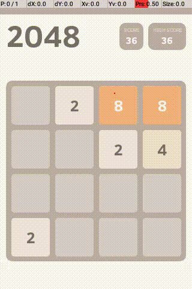

# AndroidEnv - Tasks

<!-- copybara:strip_begin -->

<!--*
# Document freshness: For more information, see go/fresh-source.
freshness: { owner: 'agergely' reviewed: '2021-02-19' }
*-->

<!-- copybara:strip_end -->

With AndroidEnv we provide a mechanism for easily defining RL tasks for the
agent to learn. This includes various types of information such as what app/game
it should train on, what rewards the environment returns, or the start state
distribution and the episode end criteria.

## Task structure

A *task* definition is captured in the form of a `Task()` proto message. These
are most easily created by writing a `.textproto` file, then parsing it into a
proto message. In this section you can find a detailed description about the
types of information that make up a task, and an example demonstrating exactly
how to put these into code.

<details>
  <summary>Expand this tab to view the main types of information captured in these messages: </summary>

*   `id`: An ID used to identify the task.

*   `setup_steps`: These are steps the environment will perform right after
    launching the simulator. Possible steps include:

    *   `install_apk`: Installs an application from a specified path to the APK
        file.
    *   `start_activity`: Launches the requested app/activity.
    *   `rotate`: Sets the orientation of the device (landscape/portrait).

*   `reset_steps`: These are steps the environment will perform right at the
    beginning of a new RL episode. Possible steps include:

    *   `force_stop`: Stops a given app.
    *   `start_activity`: Launches the requested app/activity.
    *   `start_screen_pinning`: Restricts the agent's interaction to a
        particular activity through
        [screen pinning](https://support.google.com/android/answer/9455138?hl=en),
        meaning the agent will not be able to quit the given app.
    *   `clear_cache`: Clears the cache of a given app.

*   `success_conditions`: For each success condition defined, the environment
    will make sure that these conditions were met after finishing `setup_steps`
    and `reset_steps`. They might include conditions such as:

    *   `check_install`: Makes sure that the request app was successfully
        installed.
    *   `wait_for_app_screen`: Waits until the request app was successfully
        launched.

*   `expected_app_screen`: If this value is set to a particular activity, the
    environment will periodically check if the agent is still interacting with
    said activity, making sure it has not accidentally quit the application we
    want it to be training on.

*   `max_duration_sec`: Puts a time limit on the episodes, triggering an episode
    reset if the current episode has lasted too long.

*   `max_duration_steps`: Puts a step limit on the episodes, triggering an
    episode reset once the agent has reached the specified limit.

*   `log_parsing_config`: If the environment is parsing logcat messages, this
    field will determine what information it should listen for using regular
    expressions.

    *   `filters`: The environment filters log messages for these labels which
        signify that such messages were meant to be parsed by AndroidEnv.
    *   `log_regexps`: Once a log message was identified as relevant using the
        filters, the environment parses its contents using these regular
        expressions. For example, an application might be sending log messages
        of the form `reward: 1.0`, then the task will capture this info using
        the regexp `^[Rr]eward: ([-+]?[0-9]*\\.?[0-9]*)$`.

*   `extras_spec`: Determines the type and shape of extras exposed by the task.
    Extras are usually parsed from logcat messages.

</details>

<details>
  <summary>Expand this tab to see what an example `.textproto` file might look like in practice:</summary>

```python
id: "classic_2048"
name: "Classic 2048 - Default"
description: "Slide numbered tiles on a grid to combine them to create a tile with the number 2048"
package_name: "com.tpcstld.twozerogame"
full_activity_name: "com.tpcstld.twozerogame/com.tpcstld.twozerogame.MainActivity"

# Perform these upon launching the environment
setup_steps: [
  {
    # Install the 2048 app
    adb_call: {
      install_apk: {
        filesystem: {
          path: path/to/classic_2048.apk
        }
      }
    }
    # Check if it was installed correctly
    success_condition: {
      check_install: {
        package_name: "com.tpcstld.twozerogame"
        timeout_sec: 10.0
      }
    }
  },
  # Orient the screen in portait mode
  { adb_call: { rotate: { orientation: PORTRAIT_0 } } }
]

# Perform these upon episode resets
reset_steps: [

  # Stop the 2048 app
  { adb_call: { force_stop: { package_name: "com.tpcstld.twozerogame" } } },
  { adb_call: { clear_cache: { package_name: "com.tpcstld.twozerogame" } } },

  # Start the 2048 app
  {
    adb_call: {
      start_activity: {
        full_activity: "com.tpcstld.twozerogame/com.tpcstld.twozerogame.MainActivity"
        extra_args: [
            "--ez", '"RL_TASK_ENABLED"', '"true"',
            "--es", '"RL_TASK_GAME_CONFIG"', '"{}"'
        ]
      }
    }

    # Wait until the app has launched successfully
    success_condition: {
      wait_for_app_screen: {
        app_screen: {
          activity: "com.tpcstld.twozerogame/com.tpcstld.twozerogame.MainActivity"
          view_hierarchy_path: [
          ]
        }
        timeout_sec: 10.0
      }
      num_retries: 10
    }
  },

  # Make sure the agent cannot quit the 2048 app
  {
    adb_call: {
      start_screen_pinning: {
        full_activity: "com.tpcstld.twozerogame/com.tpcstld.twozerogame.MainActivity"
      }
    }
  }
]

# Periodically check if the agent has accidentally quit the app
expected_app_screen: {
  activity: "com.tpcstld.twozerogame/com.tpcstld.twozerogame.MainActivity"
  view_hierarchy_path: []
}

max_num_steps: 500

# Capture expected format of log messages
log_parsing_config: {
  filters: ["AndroidRLTask:V"]
  log_regexps: {
    score: "^[Ss]core: ([-+]?[0-9]*\\.?[0-9]*)$"
    reward: "^[Rr]eward: ([-+]?[0-9]*\\.?[0-9]*)$"
    episode_end: "^episode[ _]end$"
    extra: "^extra: (?P<name>[^ ]*)[ ]?(?P<extra>.*)$"
    json_extra: "^json_extra: (?P<json_extra>.*)$"
  }
}

# Capture expected shape and type of extras
extras_spec: [
  # Grid representing the state of the board.
  { name: "grid" shape: [4, 4], dtype: INT32},
  # Direction of the last swipe action that prompted that change in the state.
  # 0: up, 1: right, 2: down, 3: left
  { name: "direction" shape: [1], dtype: INT32 }
]

```

</details>

## Log messages and custom APKs

You might have noticed that tasks often rely on custom log messages exposed by
the Android system, which AndroidEnv can intercept and translate into items such
as rewards, episode end signals or task extras. Of course, applications do not
send such messages by default, so in order to have access to such messages, we
often add minor modificatios the apps' original source code to match our
expectations. For example, in the case of the 2048 app, we find in the game's
source code the exact lines where the score is computed, and add a few lines to
make sure the desired messages are sent to logcat at the right time.

TODO(agergely) Add instructions for extending an APK with logs.

You can take a look at example APKs in the example tasks mentioned in the next
section.

## Example tasks

Along with the environment implementation we provide a set of example task
definitions. These were chosen so that they would demonstrate the large variety
of different challenges (e.g. app navigtion, puzzle games, time-reactive games,
adventure games, card games...) and corresponding interfaces (e.g. button
pressing, swiping, drag-and-drop...) available in AndroidEnv. Along with the
textprotos we provide also the corresponding APKs. You can find and download
these example tasks from
[this link](https://pantheon.corp.google.com/storage/browser/android_env-tasks).

TODO(agergely) Update this link.

Apple Flinger                                                    | Blockinger                                           | Catch                                                                        | Classic 2048                                             | Clock                                      | Dodge
---------------------------------------------------------------- | ---------------------------------------------------- | ---------------------------------------------------------------------------- | -------------------------------------------------------- | ------------------------------------------ | -----
 |  |  |  |  | 
